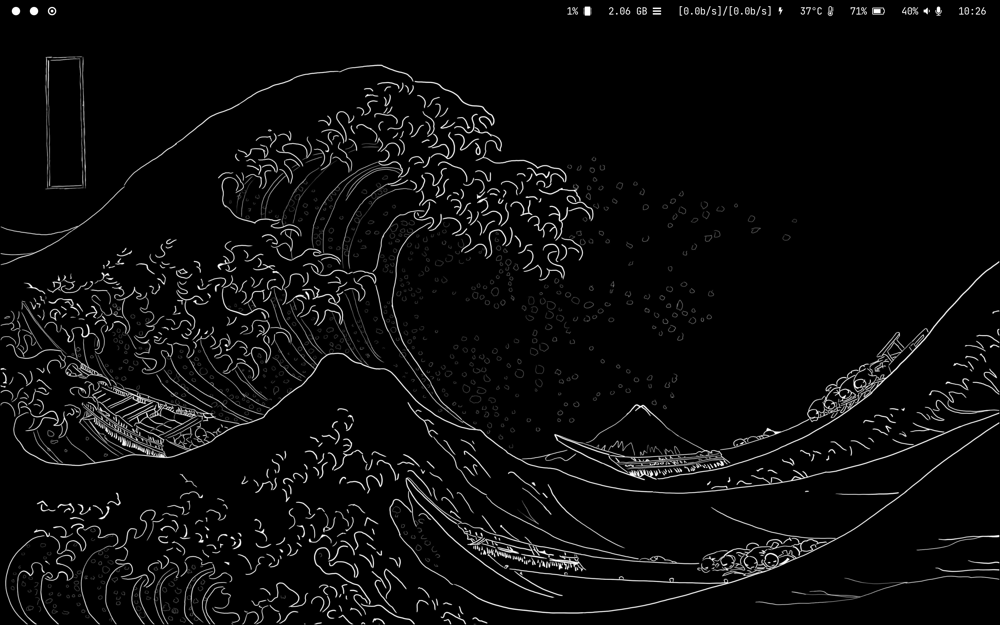
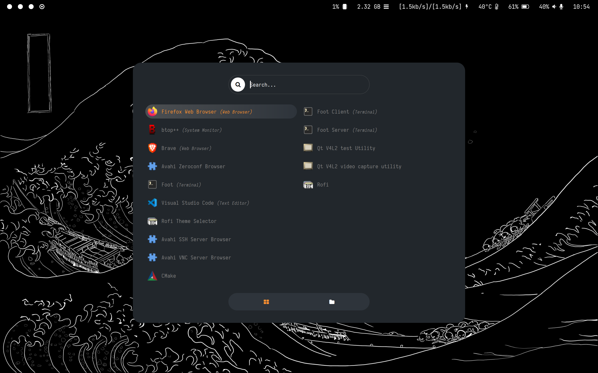

# Dotfiles
This directory aimed to share my Arch - Hyprland configuration.

## Screen
Screenshot of my background and waybar setup:

Screenshot of my rofi setup:

## Useful link

Bluetooth manager: 
[Bluetuith](https://github.com/darkhz/bluetuith)

Screen Temperature:
[wl-gammarelay-rs](https://github.com/MaxVerevkin/wl-gammarelay-rs)

Auto-mount devices:
[udiskie](https://github.com/coldfix/udiskie)

## Scripts

### Wayland-activator
This script help to automate the activation of Wayland on Electron-base programs like Visual Studio Code.
### Daynight-shifter
Script that modifies the temperature of the screen and accepts 2 modes: fixed or varying temperature according to the time.
### Battery level notifier
[battery-notify.sh](https://github.com/cybergaz/scripts/blob/main/hyprland/battery_notify.sh)
