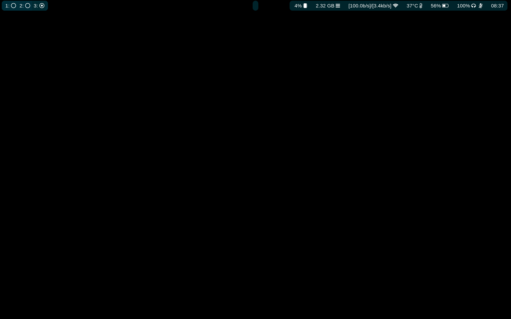
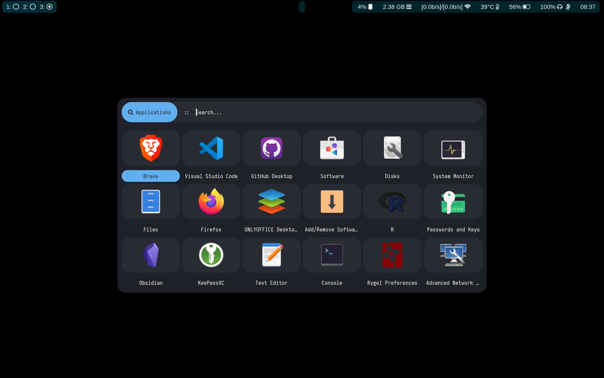

# Dotfiles
This directory aimed to share my Arch - Hyprland configuration.

## Screen
Screenshot of my background and waybar setup:

Screenshot of my rofi setup:

## Scripts

### Wayland-activator
This script help to automate the activation of Wayland on Electron-base programs like Visual Studio Code.
