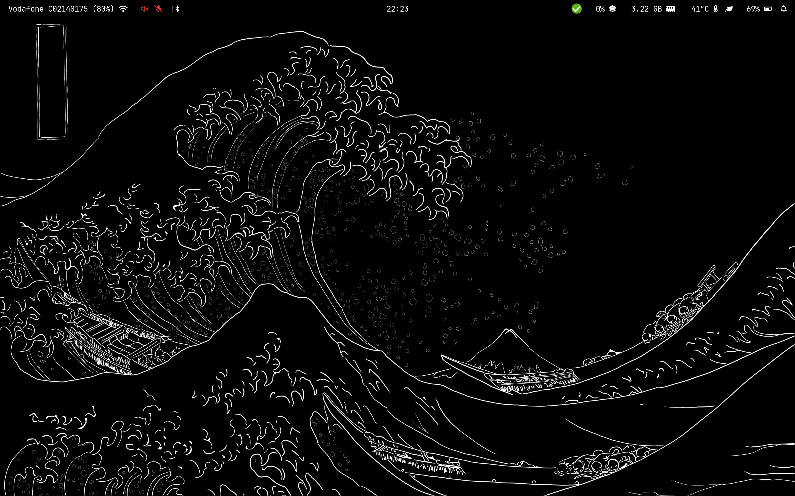
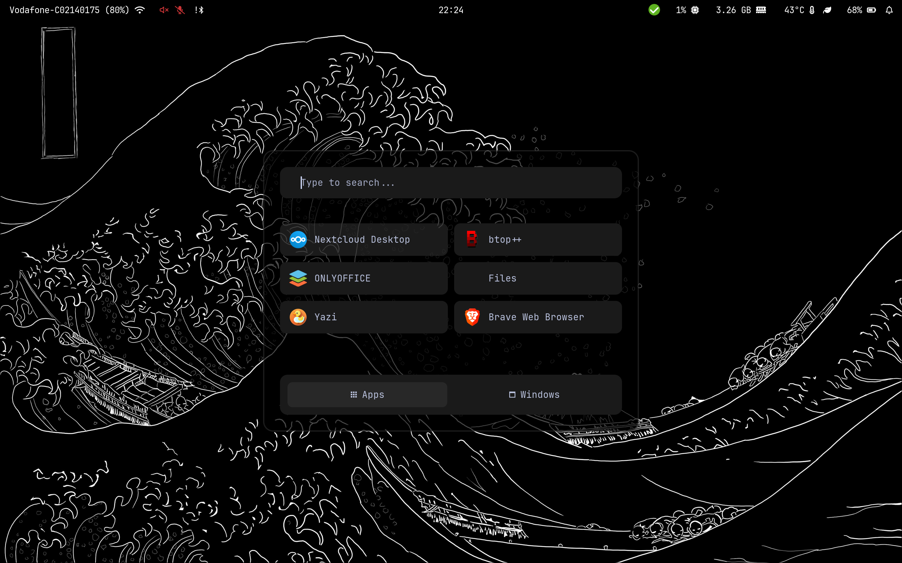
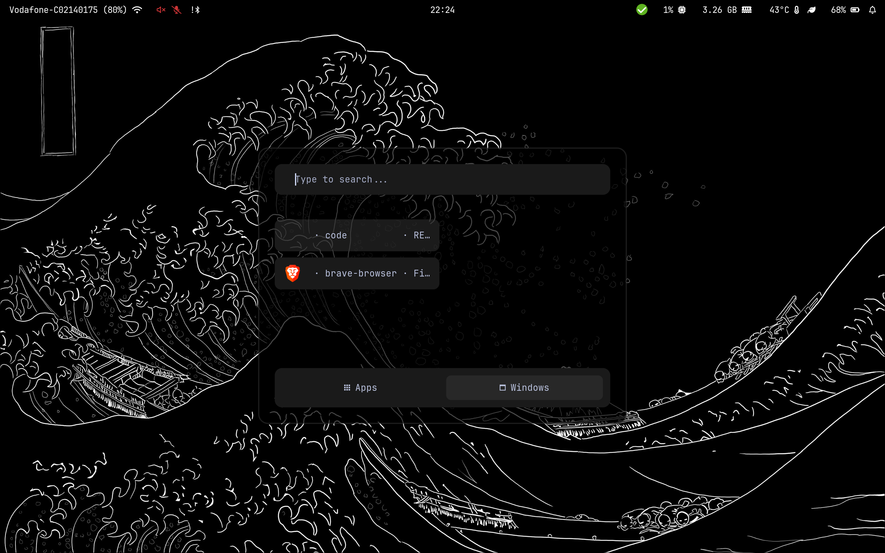
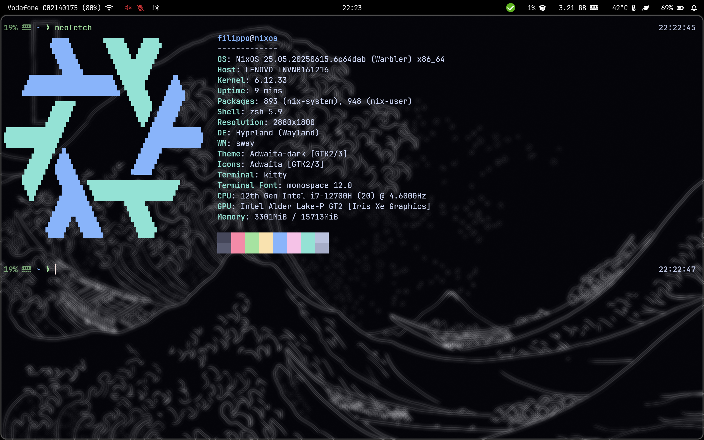

# Dotfiles

This repository contains my personal NixOS configuration, featuring **Hyprland** as the window manager. It’s designed for daily use on my laptop and is a continuous work in progress. Whether you’re looking for inspiration or a starting point for your own setup, you’ll find modular, well-organized configs here.

## ✨ Preview

Take a look at my desktop environment:

<p align="center">
  
  
</p>
<p align="center">
  
  
</p>

---

## 🚀 Quick Start

> **⚠️ Before you begin:**
> - Backup your existing `hardware-configuration.nix`.
> - Review the configs for any programs or environment variables that may not be supported by your hardware.

### 1. Clone & Link
Clone this repository and create a symbolic link from the `nixos` folder to `/etc/nixos`:

```bash
sudo ln -s /<path-to-this-repo>/nixos /etc/nixos
```

### 2. Rebuild & Switch
Apply the configuration:

```bash
sudo nixos-rebuild switch
```

### 3. Customize
- Change your **hostname** in `configuration.nix`.
- Change your **username** in `flake.nix`.

---

## 🗂️ Repository Structure

```
nixos/
│
├── programs/                     # All the programs I use
│
├── shell/                        # Terminal and shell utilities
│
├── WM/                           # Hyprland & related configs
│    └── wallpaper                # Wallpapers for home & hyprlock
│
├── configuration.nix             # Core system settings (bluetooth, wifi, boot, etc.)
├── flake.nix                     # Flake inputs & home-manager
├── home.nix                      # User environment variables & user-specific configs
├── hardware-configuration.nix    # Hardware-specific settings (edit after install)
│
└── README.md                     # This file
```

---

## 🛠️ Customization Guide

- **Add a program or utility:**
  1. Create `<utility-or-program>.nix` in the appropriate folder (e.g., `programs/`, `shell/`, or `WM/`).
  2. Import it in the folder’s `default.nix`.
- **System-wide or privileged programs:**
  - Add them to `configuration.nix`.

This modular approach keeps everything organized and easy to maintain!

---

## 💡 Tips
- Use [home-manager](https://github.com/nix-community/home-manager) for user-level configuration.
- Tweak and experiment! NixOS is all about reproducibility and customization.

---

Enjoy your new setup! If you have questions or suggestions, feel free to open an issue or PR. 😊
