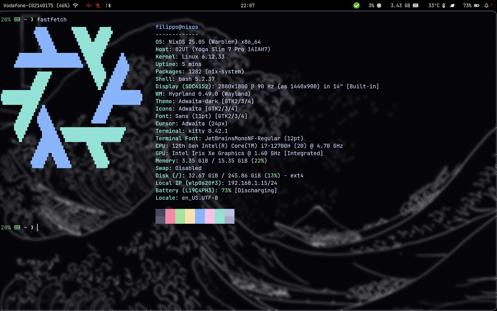

# Dotfiles

This directory aimed to share my NixOS configuration with Hyprland as Window Manager. This repo contains my daily laptop configuration and is WIP.

## Preview




## To install it
> **ALERT:** \
> Before installing it, keep your `hardware-configuration.nix` and check if there are some programs or environments variable not supported by your hardware.

To install my configuration on NixOS you need to do a soft link to of this nixos folder to the one in the /etc: 
``` Bash
sudo ln -s /<path-to-this-repo>/nixos /etc/   
```
After that you need to generate the new generation and switch to it with: 
``` Bash
sudo nixos-rebuild switch
```
You could change the hostname of your computer inside `configuration.nix` while the username into the file `flake.nix`.

## How this repo works
```
nixos/
│
├── programs/                     # All the programs I use
│
├── shell/                        # All the config that concern the terminal and its utility
│
├── WM/                           # All the config for hyprland related things ti have a usable computer
│    └── wallpaper                # Contains the home wallpaper and the one used by hyprlock
│
├── configuration.nix             # All about basic computer settings (bluetooth, wifi, boot options and so on)
├── flake.nix                     # Settings about input repo and home-manager 
├── home.nix                      # Settings about userspace like environments variables and call to specific folders
├── hardware-configuration.nix    # Settings about my computer - modify it with the one generated during installation
│
└── README.md                     
```
## How to customize it
My logic to add more programs or utility using home-manager is to create the <utility/programs name>.nix in the appropriate folder and add it in it also in the `default.nix` of its folder.
In case of programs which require strong permission or system-wise setting I follow the same logic and add it to `configuration.nix`.
